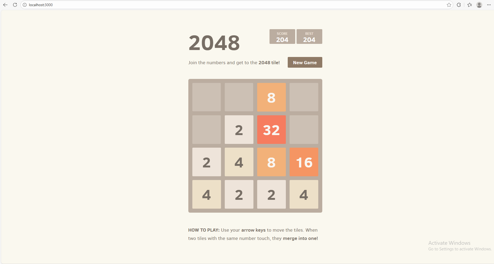

<h1>Production-grade-eks-project</h1>

<h2> Overview </h2>

This project involves deploying application which is a 2048 game application to an EKS cluster running in AWS. The tech stack used in this project are as follows: AWS CDk, Docker, AWS, Kubernetes, ArgoCD, Helm, Prometheus, Grafana and GitHub actions. AWS services such as EKS, ECR, VPC and Route53 were utilised for this project.

This README outlines step-by-step instructions for running the 2048 game app locally, how to run this app on a Docker container locally, pushing your container image for this app to AWS ECR, and spinning up the infrastructure to deploy the containerised application to AWS EKS.

<h2> Architectural diagram of the project </h2>

Below is an architectural diagram of the infrastructure that we are going to be setting up in this project:

<Insert Architectural diagram>

<h2> Directory Structure </h2>

Below is an overview of that this directory structure will look like for this project:

```hcl
|-- README.md
|-- app
|   |-- CONTRIBUTING.md
|   |-- Dockerfile
|   |-- LICENSE.txt
|   |-- Rakefile
|   |-- favicon.ico
|   |-- index.html
|   |-- js
|   |   |-- animframe_polyfill.js
|   |   |-- application.js
|   |   |-- bind_polyfill.js
|   |   |-- classlist_polyfill.js
|   |   |-- game_manager.js
|   |   |-- grid.js
|   |   |-- html_actuator.js
|   |   |-- keyboard_input_manager.js
|   |   |-- local_storage_manager.js
|   |   `-- tile.js
|   |-- meta
|   |   |-- apple-touch-icon.png
|   |   |-- apple-touch-startup-image-640x1096.png
|   |   `-- apple-touch-startup-image-640x920.png
|   |-- package-lock.json
|   `-- style
|       |-- fonts
|       |   |-- ClearSans-Bold-webfont.eot
|       |   |-- ClearSans-Bold-webfont.svg
|       |   |-- ClearSans-Bold-webfont.woff
|       |   |-- ClearSans-Light-webfont.eot
|       |   |-- ClearSans-Light-webfont.svg
|       |   |-- ClearSans-Light-webfont.woff
|       |   |-- ClearSans-Regular-webfont.eot
|       |   |-- ClearSans-Regular-webfont.svg
|       |   |-- ClearSans-Regular-webfont.woff
|       |   `-- clear-sans.css
|       |-- helpers.scss
|       |-- main.css
|       `-- main.scss
|-- bin
|   `-- eks-project.ts
|-- cdk.context.json
|-- cdk.json
|-- jest.config.js
|-- k8s-manifest-files
|   |-- apps
|   |   |-- deployment.yaml
|   |   |-- ingress.yaml
|   |   `-- service.yaml
|   |-- argocd
|   |   `-- argocd.yaml
|   `-- cert-manager
|       `-- issuer.yaml
|-- lib
|   |-- eks-stack.ts
|   |-- helm-stack.ts
|   `-- networking-stack.ts
|-- package-lock.json
|-- package.json
|-- test
|   `-- coderco-eks-project.test.ts
`-- tsconfig.json
```

<h2> Prerequisites </h2>

🛠 In order to follow this project you will need to have the following installed:

- ✅ An AWS Account with an IAM user(do not use the root account) - [Create An Account Here](https://aws.amazon.com/free/?trk=ce1f55b8-6da8-4aa2-af36-3f11e9a449ae&sc_channel=ps&ef_id=Cj0KCQjw782_BhDjARIsABTv_JCWZitQyH0tU_lYElDDQ9HdBabDxB-tKSgYDsRiU0N_XqiVVpjvBTUaAmR7EALw_wcB:G:s&s_kwcid=AL!4422!3!433803621002!e!!g!!aws%20sign%20up!9762827897!98496538743&gclid=Cj0KCQjw782_BhDjARIsABTv_JCWZitQyH0tU_lYElDDQ9HdBabDxB-tKSgYDsRiU0N_XqiVVpjvBTUaAmR7EALw_wcB&all-free-tier.sort-by=item.additionalFields.SortRank&all-free-tier.sort-order=asc&awsf.Free%20Tier%20Types=*all&awsf.Free%20Tier%20Categories=*all)

- ✅ Docker - [Download & Install](https://www.docker.com/get-started/)

- ✅ Node.js & npm - [Download & Install](https://docs.npmjs.com/downloading-and-installing-node-js-and-npm)

- ✅ Typescript - [Download & Install](https://www.npmjs.com/package/typescript)

- ✅ Python - [Download & Install](https://www.python.org/downloads/)

- ✅ AWS CDK - [Download & Install](https://docs.aws.amazon.com/cdk/v2/guide/getting-started.html)

- ✅ Kubectl - [Download & Install](https://kubernetes.io/docs/tasks/tools/)

<h2> Step 1: Running app locally </h2>

Let us first get this 2048 game app running on our local machine first before containerising it

Run the following commands below to get this app running locally:

Ensure you have node.js installed first

```hcl
node -v 
npm -v
```

Startup a local http server on your machine to run the app on
```hcl 
python -m http.server 3000
```

Access the app through your localhost

```hcl 
http://localhost:3000/
```

If this has worked successfully, you should see the following app be displayed:



<h2> Step 2: Running app locally in Docker container </h2>

Let us now get this 2048 game app running within a Docker container. Before we do this, we need to ensure we have a docker image built for the app:

- Changed directory into the `/app` direction:

```hcl
cd app
```

- Build the Docker image:

```hcl
docker build -t <name of docker image:tag> .
```

- Start up the Docker container:

```hcl
docker run -d -p 3000:3000 --rm -name game-container <name of docker image:tag>
```

- Access the container app via your localhost:

```hcl
https://localhost:3000/
```

You should now be presented with the 2048 game app.

Now that we have ran the app locally, and have ran it locally within a Docker container, it is time to get this app running within AWS EKS.

<h2> Step 3: Pushing up Docker image to AWS ECR </h2>

- Create an ECR repository - [click here to know how to do this](https://docs.aws.amazon.com/AmazonECR/latest/userguide/repository-create.html)

- After you created the ECR repository, click into the ECR repository and press `View push commands`. This will provide you with a list of commands to run to get your Docker image pushed to your ECR repository.

After following the steps on how to push your Docker image to your ECR repo, you should now see your Docker image in ECR.

<h2> Step 4: Deploying infrastructure </h2>

Now that we have our Docker image in AWS ECR, it is time to spin up the infrastrcuture. There are few things you will need to do first before we deploy the infrastructure.
 
- Within the `lib` directory, create a `.env` file. Inside of this file, create these 2 envrionment variables:

  - `CDK_DEFAULT_ACCOUNT=<you AWS account id>`

  - `CDK_DEFAULT_REGION=<the region you will be deploying your infrastructure to>`

- After you have done that commit your changes and push them up to your main branch:
```hcl
  git add -A
  git commit -m <your commit message>
  git push
```

- Once you have deployed your changes, you will see the `cdk-diff` GitHub actions workflow running. This workflow inform you on what is being deployed to AWS.

- After that workflow has successfully ran, manually run the cdk-deploy workflow: this workflow will deploy the whole infrastructure to AWS.

<h2> Step 5: Setting up few things within the EKS cluster </h2>

After your workflow has successfully ran, you will need to access the cluster to set up a few things:

- Run this command to access the EKS cluster:
```hcl
  aws eks update-kubeconfig --name <name of the cluster which you can get from the output of the deployment> --region <region you are accesing this cluster from>
```

- Run this to ensure you can successfully run commands within the cluster:
```hcl
  kubectl get pods -A
```

- Run this command to set up your cluster issuer for cert-manager to get certificates from:
```hcl
  kubectl apply -f k8s-manifest-files/cert-manager/issuer.yaml
```

- Run this command to setup argo-cd:
```hcl
  kubectl apply -f k8s-manifest-files/argo-cd/argocd.yaml
```

After having set up these 2 things you will now have:
- argo-cd tracking changes made to the manifest files in /apps and apply those manifest files to have your container app be running within the pods.

- A cluster issuer for cert-manager to get ssl certificates from.

<h2> Step 6: Accessing Argo-cd ui </h2>

In order to access the Argo-cd ui to see our app deployment, you will need to first get both the username and password. This will also be the same for the Grafana Ui.

- Firstly, run the following command:

  ```hcl
  kubectl get pods -n argo-cd
  ```

- Locate the pod <name of pod>, and then run this command:

  ```hcl
  kubectl get secret -n argo-cd <name of argocd secret> -o yaml
  ```

- After you run that command, you will a bunch of output in yaml format. Go to the where is says password and copy it.

- Then run this command with your password still copied:

  ```hcl
  echo <the password you copied> | base64 -d
  ```

- This will give you your password for accessing the argo ui. Access the argo ui through typing argo-cd.cdk-labs.com. You should be presented with the following screen:

<image>

<h2> Step 7: Viewing your deployment in argo-cd </h2>

Now it is time to access your app that is running within the EKS cluster, being managed by argo-cd:

- Enter yout username and password:

  - The username to enter is admin (it will always be admin)

  - Then enter the password that you de-encoded.

- After that you should have successfully accessed argo-cd. You should see your various k8s resources for your app:

- If the pods are green, then it means the pods are now running your 2042 game app container image. You can access the app by typing in the following domain name: apps.cdk-labs.com. If everything went well, and you did exactly what is here, you should be presented with 2048 game app.

<h2> Step 8: Accessing the Grafana ui </h2>

You would have noticed that we deployed a Prometheus Helm Chart that comes with Grafana. This Helm chart sets up our whole Prometheus Stack for us, in terms of setting up all the components needs to scrape and collect metric data from your pods and nodes within the EKS cluster. We can use grafana to visualise our application metric data with regards to the cpu and memory usage of our deployment pods.

To view this data:

- Go ahead and access grafana via `grafana.cdk-labs.com`

- Similar to argo-cd, you will need a username (which is admin) and password.

- To get the password it is exact same process for how we got the password for the argo-cd ui. Run these two commands:

  ```hcl
  kubectl get secret -n prometheus grafana-secret -o yaml
  ```

  ```hcl
  echo <the password you copied> | base64 -d
  ```

<h2> Step 9: View your app metrics using Grafana </h2>


<h2> Step 10: Destroying everything </h2>

Now that you were able to successfully access the app running within AWS EKS, it is time to destroy the whole infrastructure. Go to the GitHub Actions parts of the repo, and you will see a workflow called `CDK Destroy Workflow`. Run the workflow to destroy the whole infrastructure.